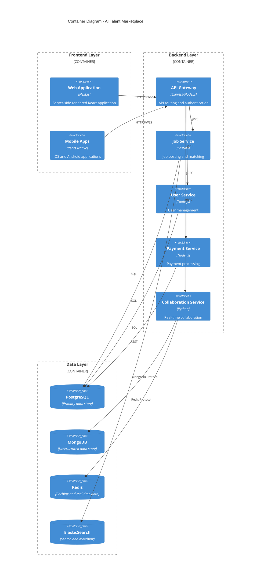

# AI Talent Marketplace

[](https://github.com/ai-talent-marketplace/platform/actions)
[](LICENSE)
[](https://hub.docker.com/r/aitalentmarketplace)
[](https://api.aitalentmarketplace.com/docs)

## Table of Contents

- [Overview](#overview)
- [Features](#features)
- [Architecture](#architecture)
- [Technology Stack](#technology-stack)
- [Repository Structure](#repository-structure)
- [Setup Instructions](#setup-instructions)
- [Development Guidelines](#development-guidelines)
- [Deployment Instructions](#deployment-instructions)
- [API Documentation](#api-documentation)
- [Contributing](#contributing)
- [License](#license)

## Overview

The AI Talent Marketplace is a specialized platform designed to connect businesses with verified AI professionals for project-based work. The system addresses the critical challenge of efficiently matching companies with qualified AI talent through an AI-powered recommendation engine, secure payment processing, and built-in collaboration tools.

Our platform reduces hiring time by 60% compared to general freelancing platforms while ensuring higher quality matches through AI-specific vetting processes. By focusing exclusively on AI talent and providing specialized tools like integrated Jupyter Notebooks and model sharing capabilities, the platform establishes itself as the premier destination for AI project staffing in a projected market size of $62B by 2025.

## Features

- **AI-Powered Matching**: Advanced algorithms match businesses with the most suitable AI talent based on project requirements and expertise
- **Verified AI Expert Profiles**: Comprehensive profiles with validated skills, portfolios, and performance metrics
- **Secure Payment Processing**: Escrow services and milestone-based payments to ensure fair transactions
- **Built-in Collaboration Tools**: Integrated Jupyter Notebooks, version control, and model sharing capabilities
- **Smart Contract Creation**: Automated contract generation with clear deliverables and milestones
- **Real-time Communication**: In-platform messaging and collaboration features
- **Enterprise Integration**: Seamless integration with existing HR systems, Git workflows, and AI development tools

## Architecture

The AI Talent Marketplace is built using a microservices architecture to ensure scalability, maintainability, and resilience. Each component is designed to be independently deployable while working together to provide a cohesive platform experience.

### High-Level Architecture

```mermaid
C4Context
    title System Context Diagram - AI Talent Marketplace

    Person(client, "Client", "Business seeking AI talent")
    Person(freelancer, "AI Professional", "AI/ML expert offering services")
    Person(admin, "Administrator", "Platform administrator")

    System_Boundary(platform, "AI Talent Marketplace") {
        System(web, "Web Platform", "Next.js frontend + Node.js backend")
        System(mobile, "Mobile Apps", "React Native iOS/Android apps")
        System(api, "API Gateway", "REST/GraphQL endpoints")
    }

    System_Ext(payment, "Payment System", "Stripe")
    System_Ext(github, "GitHub", "Portfolio verification")
    System_Ext(cloud, "Cloud Services", "AWS infrastructure")
    System_Ext(ml, "AI Services", "OpenAI/ElasticSearch")

    Rel(client, platform, "Posts jobs, hires talent")
    Rel(freelancer, platform, "Offers services, completes projects")
    Rel(admin, platform, "Manages platform")
    
    Rel(platform, payment, "Processes payments")
    Rel(platform, github, "Verifies portfolios")
    Rel(platform, cloud, "Hosts infrastructure")
    Rel(platform, ml, "AI matching/recommendations")
```

### Container Architecture



### Key Components

- **Web Frontend**: Server-side rendered React application built with Next.js
- **Mobile Apps**: Cross-platform iOS and Android applications built with React Native
- **API Gateway**: Central entry point handling authentication, request routing, and rate limiting
- **Microservices**: Specialized services for user management, job matching, payments, and collaboration
- **Database Layer**: Combination of PostgreSQL, MongoDB, Redis, and ElasticSearch for different data needs
- **Infrastructure**: Cloud-native architecture deployed on Kubernetes in AWS

## Technology Stack

### Backend

- **Node.js** (v18.x) - Core runtime for most microservices
- **TypeScript** (v5.x) - Type-safe JavaScript for backend services
- **Express.js** (v4.18.x) - Web framework for the API Gateway
- **FastAPI** (v0.100.x) - Python framework for AI-specific services
- **Socket.io** (v4.7.x) - Real-time communication framework
- **gRPC** (v1.x) - High-performance RPC framework for inter-service communication
- **Prisma** (v5.x) - Type-safe ORM for database interactions
- **Pydantic** (v2.x) - Data validation and settings management for Python services

### Frontend

- **Next.js** (v13.x) - React framework for server-side rendering
- **React** (v18.x) - UI library for component-based development
- **TailwindCSS** (v3.x) - Utility-first CSS framework
- **Redux Toolkit** (v1.9.x) - State management for React applications
- **React Query** (v4.x) - Data fetching and caching library
- **Storybook** (v7.x) - UI component documentation and testing

### Mobile

- **React Native** (v0.72.x) - Cross-platform mobile app framework
- **Expo** (v49.x) - Tools and services for React Native development
- **React Navigation** (v6.x) - Routing and navigation for React Native
- **Redux Toolkit** (v1.9.x) - State management for React Native applications
- **React Native Paper** (v5.x) - Material Design components for React Native

### Databases

- **PostgreSQL** (v15.x) - Primary relational database
- **MongoDB** (v6.x) - Document database for unstructured data
- **Redis** (v7.x) - In-memory data store for caching and real-time features
- **ElasticSearch** (v8.x) - Search and analytics engine for AI matching

### Infrastructure & DevOps

- **Docker** (v24.x) - Containerization platform
- **Kubernetes** (v1.27.x) - Container orchestration
- **AWS** - Cloud infrastructure provider
- **Terraform** (v1.5.x) - Infrastructure as code
- **GitHub Actions** - CI/CD automation
- **ArgoCD** - Kubernetes GitOps continuous delivery
- **Prometheus/Grafana** - Monitoring and observability
- **ELK Stack** - Logging and analysis

### AI & ML

- **OpenAI API** - AI models for matching and recommendations
- **PyTorch** (v2.x) - Machine learning framework
- **Jupyter** - Interactive computing for AI development
- **Scikit-learn** (v1.3.x) - Machine learning tools
- **Hugging Face Transformers** (v4.x) - NLP models and tools

## Repository Structure

```
ai-talent-marketplace/
├── .github/                      # GitHub workflows and templates
├── src/                          # Source code
│   ├── backend/                  # Backend services
│   │   ├── api-gateway/          # API Gateway service
│   │   ├── user-service/         # User management service
│   │   ├── job-service/          # Job posting and matching service
│   │   ├── payment-service/      # Payment processing service
│   │   ├── collaboration-service/ # Real-time collaboration service
│   │   └── ai-service/           # AI/ML recommendation service
│   ├── web/                      # Next.js web application
│   ├── mobile/                   # React Native mobile applications
│   │   ├── ios/                  # iOS-specific code
│   │   └── android/              # Android-specific code
│   └── shared/                   # Shared libraries and utilities
├── infrastructure/               # Infrastructure as code
│   ├── terraform/                # Terraform configuration
│   └── kubernetes/               # Kubernetes manifests
├── docs/                         # Documentation
│   ├── api/                      # API documentation
│   ├── architecture/             # Architecture documentation
│   └── guides/                   # User and developer guides
├── scripts/                      # Development and deployment scripts
├── .env.example                  # Example environment variables
├── docker-compose.yml            # Local development setup
├── package.json                  # Root package.json for monorepo
└── README.md                     # This file
```

## Setup Instructions

### Prerequisites

- **Node.js** (v18 or higher)
- **Python** (v3.11 or higher)
- **Docker** and **Docker Compose**
- **Git**
- **npm** or **pnpm** (v8 or higher)

### Initial Setup

1. Clone the repository:
   ```bash
   git clone https://github.com/ai-talent-marketplace/platform.git
   cd platform
   ```

2. Create environment files:
   ```bash
   cp .env.example .env
   ```

3. Install dependencies:
   ```bash
   # Install root dependencies
   pnpm install
   
   # Install service-specific dependencies
   pnpm run bootstrap
   ```

### Running with Docker Compose

For local development with all services:

```bash
docker-compose up
```

This will start all services, including databases and the API gateway. The web application will be available at http://localhost:3000.

### Running Individual Services

To run specific services for development:

```bash
# Start the web application
cd src/web
pnpm dev

# Start the API gateway
cd src/backend/api-gateway
pnpm dev

# Start a specific microservice (e.g., user-service)
cd src/backend/user-service
pnpm dev
```

### Database Setup

The platform uses multiple databases. For local development, Docker Compose will set these up automatically. To initialize the databases with seed data:

```bash
pnpm run db:seed
```

### Troubleshooting

Common issues and solutions:

- **Port conflicts**: Check if the required ports (3000, 4000, 5432, 27017, 6379, 9200) are available
- **Database connection issues**: Ensure Docker containers are running properly
- **Environment variables**: Verify all required variables are set in the `.env` file

## Development Guidelines

### Development Workflow

We follow a GitHub Flow workflow:

1. Create a feature branch from `main`: `git checkout -b feature/your-feature-name`
2. Make changes and commit: `git commit -am "Add feature X"`
3. Push to the branch: `git push origin feature/your-feature-name`
4. Open a Pull Request against `main`
5. After review and approval, merge into `main`

### Code Style and Linting

We use ESLint and Prettier for code quality and formatting:

```bash
# Run linting
pnpm lint

# Auto-fix linting issues
pnpm lint:fix

# Format code
pnpm format
```

### Testing

Each component should have unit and integration tests:

```bash
# Run all tests
pnpm test

# Run tests for a specific service
cd src/backend/user-service
pnpm test

# Run tests with coverage
pnpm test:coverage
```

### Database Migrations

For schema changes:

```bash
# Create a new migration
cd src/backend/service-name
pnpm prisma migrate dev --name migration-name

# Apply migrations
pnpm prisma migrate deploy
```

### Adding a New Service

1. Create a new directory in `src/backend/`
2. Initialize with the service template: `pnpm run generate:service my-service-name`
3. Implement the service following the established patterns
4. Add the service to `docker-compose.yml` and Kubernetes manifests

## Deployment Instructions

### Containerization

All services are containerized using Docker:

```bash
# Build all Docker images
pnpm run docker:build

# Build a specific service image
pnpm run docker:build --service=user-service
```

### Kubernetes Deployment

The platform is deployed to Kubernetes using ArgoCD:

1. Apply the base configuration:
   ```bash
   kubectl apply -f infrastructure/kubernetes/base
   ```

2. Apply the environment-specific configuration:
   ```bash
   kubectl apply -f infrastructure/kubernetes/environments/production
   ```

### CI/CD Pipeline

Our GitHub Actions workflows handle:

1. Building and testing on all PRs
2. Building and pushing Docker images on merge to `main`
3. Deploying to development environment on merge to `main`
4. Deploying to staging/production after manual approval

### Environment Configuration

Environment-specific configurations are managed through:

1. Kubernetes ConfigMaps and Secrets
2. AWS Parameter Store for sensitive values
3. Environment-specific Terraform variables

### Monitoring and Observability

After deployment, monitor the application using:

- **Grafana dashboards**: For metrics visualization
- **Kibana**: For log analysis
- **Prometheus alerts**: For notification of issues

## API Documentation

### API Overview

The platform provides a comprehensive set of APIs for all functionality:

- REST API for most service interactions
- GraphQL API for complex data fetching
- WebSocket API for real-time features

### Authentication

APIs are secured using JWT authentication:

```bash
# Example authentication request
curl -X POST https://api.aitalentmarketplace.com/v1/auth/login \
  -H "Content-Type: application/json" \
  -d '{"email": "user@example.com", "password": "password"}'
```

### API Documentation

Full API documentation is available:

- **Swagger/OpenAPI**: https://api.aitalentmarketplace.com/docs
- **Postman Collection**: https://www.postman.com/aitalentmarketplace/workspace
- **GraphQL Playground**: https://api.aitalentmarketplace.com/graphql

### Key Endpoints

```
# User Management
POST   /api/v1/auth/register        # Register new user
POST   /api/v1/auth/login           # Login user
GET    /api/v1/users/me             # Get current user profile

# Job Management
GET    /api/v1/jobs                 # List jobs
POST   /api/v1/jobs                 # Create job
GET    /api/v1/jobs/{id}            # Get job details

# Proposals
POST   /api/v1/jobs/{id}/proposals  # Submit proposal
GET    /api/v1/proposals            # List user proposals

# Contracts
POST   /api/v1/contracts            # Create contract
GET    /api/v1/contracts/{id}       # Get contract details

# Payments
POST   /api/v1/payments             # Create payment
GET    /api/v1/payments             # List payments
```

## Contributing

We welcome contributions from the community! Please review our contributing guidelines before submitting pull requests.

### Submitting Issues

1. Use the issue templates to report bugs or request features
2. Provide clear reproduction steps for bugs
3. For feature requests, explain the use case and expected behavior

### Pull Request Process

1. Ensure your code adheres to our style guidelines
2. Include tests for all new features or bug fixes
3. Update documentation as needed
4. Reference any related issues in your PR description
5. Wait for review and address any feedback

### Code Review Process

All PRs require at least one approval from a core team member. Reviewers will check for:

- Code quality and adherence to standards
- Comprehensive test coverage
- Documentation updates
- Performance considerations
- Security implications

## License

This project is licensed under the MIT License - see the [LICENSE](LICENSE) file for details.

---

Built with ❤️ by the AI Talent Marketplace Team