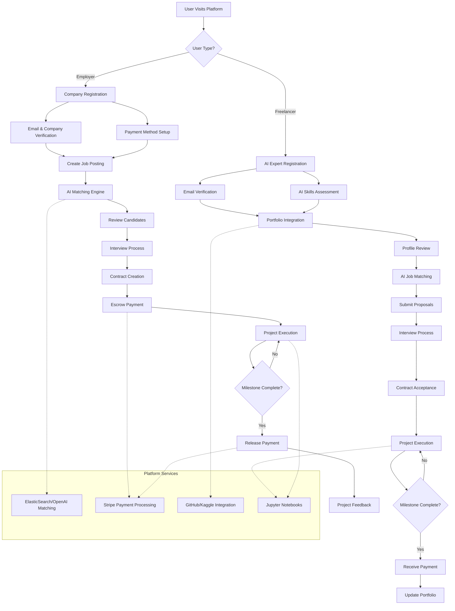
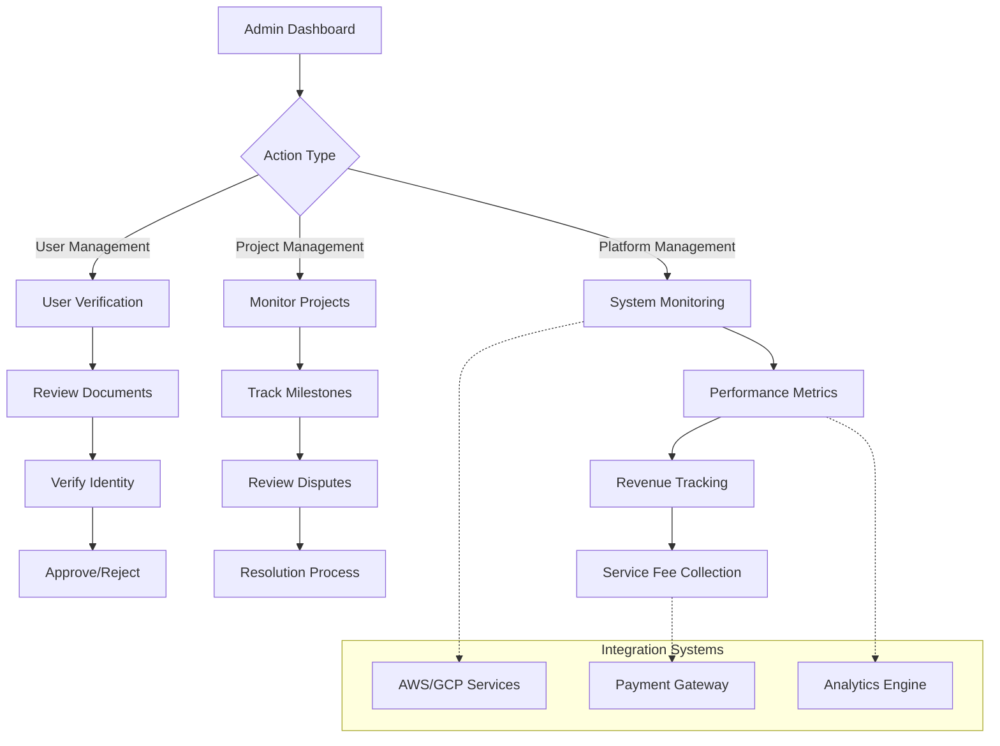
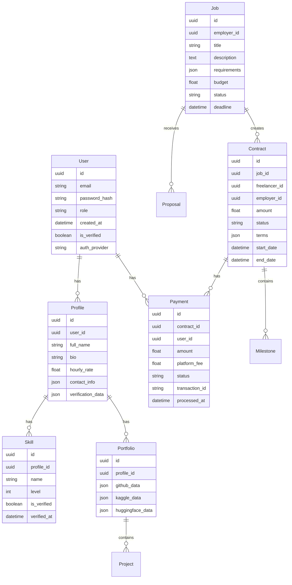
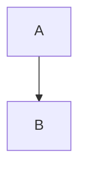

# Product Requirements Document (PRD)

# 1. INTRODUCTION

## 1.1 Purpose

This Software Requirements Specification (SRS) document provides a comprehensive description of the AI Talent Marketplace platform. It details the functional and non-functional requirements for developers, project managers, QA teams, and stakeholders involved in building this specialized freelancing platform for AI professionals.

## 1.2 Scope

The AI Talent Marketplace is a web and mobile platform that facilitates connections between businesses and AI professionals. The system encompasses:

- AI-powered job matching and recommendation engine
- Comprehensive profile and portfolio management for AI specialists
- End-to-end hiring workflow from job posting to payment processing
- Built-in collaboration tools including Jupyter Notebooks integration
- Secure payment processing with escrow capabilities
- Contract management and milestone tracking
- Skill assessment and verification systems

### 1.2.1 Product Features

- Advanced AI-driven matching algorithms using ElasticSearch/OpenAI Embeddings
- Real-time communication tools
- Integrated development environment for code collaboration
- Multi-platform support (Web, iOS, Android)
- Payment processing via Stripe
- Third-party integrations with GitHub, Hugging Face, and Kaggle

### 1.2.2 Benefits

- Reduced hiring time for AI-specific roles
- Verified and pre-vetted AI talent pool
- Secure milestone-based payment system
- Specialized collaboration tools for AI projects
- Transparent project tracking and management
- Risk mitigation through escrow services

### 1.2.3 System Context

The platform will be deployed on cloud infrastructure (AWS/GCP/Azure) using containerization (Docker + Kubernetes) and will integrate with:

- Payment processors
- Version control systems
- Professional networking platforms
- AI model repositories
- Calendar scheduling services

# 2. PRODUCT DESCRIPTION

## 2.1 Product Perspective
The AI Talent Marketplace operates as a standalone web and mobile platform while integrating with various external systems:

- Cloud Infrastructure: Deployed on AWS/GCP/Azure using containerized architecture
- Payment Systems: Stripe integration for payment processing and escrow services
- Version Control: GitHub integration for portfolio verification and code collaboration
- AI Model Repositories: Hugging Face and Kaggle integration for project showcasing
- Professional Networks: LinkedIn integration for profile verification
- Development Environment: Integrated Jupyter Notebooks for collaborative coding
- Calendar Systems: Integration with scheduling services for interviews

## 2.2 Product Functions

- AI-Powered Job Matching
  - Skill-based recommendation engine using ElasticSearch/OpenAI Embeddings
  - Automated candidate screening and ranking
  - Smart pricing suggestions based on market data

- Profile Management
  - AI expertise verification system
  - Portfolio integration with GitHub/Kaggle/Hugging Face
  - Skill assessment and certification tracking

- Project Management
  - Milestone-based tracking
  - Code collaboration tools
  - Real-time progress monitoring
  - Integrated development environment

- Financial Operations
  - Escrow services
  - Milestone-based payments
  - Automated invoicing
  - Service fee processing (15%)

## 2.3 User Characteristics

| User Type | Characteristics | Technical Expertise | Platform Usage |
|-----------|----------------|---------------------|----------------|
| AI Freelancers | - AI/ML specialists - Data scientists - ML researchers | High technical proficiency in AI/ML tools and frameworks | Project execution, portfolio management, client communication |
| Companies/Startups | - Technical hiring managers - Project managers - CTOs | Moderate to high understanding of AI requirements | Talent search, project posting, contract management |
| Enterprise Clients | - Department heads - Innovation leaders | Varied technical expertise with clear business objectives | Large-scale AI project management |
| Platform Administrators | - Support staff - Technical moderators | High platform-specific knowledge | User verification, dispute resolution, platform maintenance |

## 2.4 Constraints

Technical Constraints:
- Must maintain 99.9% uptime for global accessibility
- Real-time synchronization across web and mobile platforms
- Compliance with GDPR, CCPA, and data protection regulations
- Maximum file size limits for project uploads (500MB)
- API rate limiting for third-party integrations

Business Constraints:
- 15% service fee ceiling to remain competitive
- Initial market focus on English-speaking regions
- Mandatory identity verification for all users
- Minimum project value of $1000

## 2.5 Assumptions and Dependencies

Assumptions:
- Users have reliable internet connectivity
- Freelancers possess verifiable AI expertise
- Companies can provide clear project requirements
- Users have access to standard development tools

Dependencies:
- Availability of third-party API services
- Cloud infrastructure reliability
- Payment processor uptime
- Continuous access to AI/ML frameworks
- Stable integration with version control systems
- Reliable identity verification services

# 3. PROCESS FLOWCHART

## 4. FUNCTIONAL REQUIREMENTS

### 4.1 User Management System

#### ID: F001
#### Description: User registration, authentication, and profile management system
#### Priority: High
#### Requirements:

| ID | Requirement | Priority | Notes |
|----|------------|----------|--------|
| F001.1 | Support OAuth authentication via Google, GitHub, and LinkedIn | High | Using standard OAuth2.0 protocols |
| F001.2 | Email verification system for new accounts | High | AWS SES integration |
| F001.3 | Role-based access control (Freelancer, Employer, Admin) | High | Using JWT tokens |
| F001.4 | Two-factor authentication support | Medium | SMS/Authenticator app |
| F001.5 | Profile creation and management for AI professionals | High | Including skill matrix |

### 4.2 Job Management System

#### ID: F002
#### Description: Comprehensive job posting and management functionality
#### Priority: High
#### Requirements:

| ID | Requirement | Priority | Notes |
|----|------------|----------|--------|
| F002.1 | AI-specific job posting creation interface | High | Using ElasticSearch |
| F002.2 | Job matching algorithm using OpenAI Embeddings | High | Integration with OpenAI API |
| F002.3 | Automated candidate screening system | Medium | ML-based ranking |
| F002.4 | Job status tracking and management | High | Real-time updates |
| F002.5 | Job search with advanced filtering | High | ElasticSearch implementation |

### 4.3 Communication System

#### ID: F003
#### Description: Real-time communication and collaboration tools
#### Priority: High
#### Requirements:

| ID | Requirement | Priority | Notes |
|----|------------|----------|--------|
| F003.1 | Real-time chat system | High | Using Redis/WebSocket |
| F003.2 | Video call integration | Medium | WebRTC implementation |
| F003.3 | File sharing system | High | AWS S3 storage |
| F003.4 | Jupyter Notebook collaboration | High | Docker containers |
| F003.5 | Code review system | Medium | GitHub API integration |

### 4.4 Payment System

#### ID: F004
#### Description: Secure payment processing and escrow services
#### Priority: High
#### Requirements:

| ID | Requirement | Priority | Notes |
|----|------------|----------|--------|
| F004.1 | Stripe payment integration | High | Including 3D Secure |
| F004.2 | Escrow service management | High | Custom implementation |
| F004.3 | Milestone-based payment release | High | Automated triggers |
| F004.4 | Automated invoicing system | Medium | PDF generation |
| F004.5 | Service fee calculation (15%) | High | Automated processing |

### 4.5 Portfolio Integration System

#### ID: F005
#### Description: Integration with external portfolio platforms
#### Priority: Medium
#### Requirements:

| ID | Requirement | Priority | Notes |
|----|------------|----------|--------|
| F005.1 | GitHub repository integration | High | OAuth + API |
| F005.2 | Kaggle profile integration | Medium | API integration |
| F005.3 | Hugging Face model showcase | Medium | API integration |
| F005.4 | Portfolio analytics | Low | Custom metrics |
| F005.5 | Automatic skill verification | Medium | ML-based verification |

### 4.6 Administration System

#### ID: F006
#### Description: Platform administration and monitoring tools
#### Priority: High
#### Requirements:

| ID | Requirement | Priority | Notes |
|----|------------|----------|--------|
| F006.1 | User verification system | High | ID verification service |
| F006.2 | Dispute resolution management | High | Ticketing system |
| F006.3 | Platform analytics dashboard | Medium | Custom metrics |
| F006.4 | Content moderation tools | Medium | ML-based filtering |
| F006.5 | Revenue tracking system | High | Automated reporting |

# 5. NON-FUNCTIONAL REQUIREMENTS

## 5.1 Performance Requirements

| Metric | Requirement | Description |
|--------|-------------|-------------|
| Response Time | < 2 seconds | API endpoints must respond within 2 seconds under normal load |
| Page Load Time | < 3 seconds | Initial page load including all assets |
| Real-time Updates | < 500ms | For chat and collaboration features |
| API Rate Limits | 100 requests/minute | Per user rate limiting for external API calls |
| Database Queries | < 100ms | 95% of database queries must complete within 100ms |
| File Upload | < 30 seconds | For files up to 500MB |
| Search Results | < 1 second | For ElasticSearch/OpenAI Embedding queries |
| WebSocket Connections | 10,000 concurrent | Minimum concurrent WebSocket connection support |

## 5.2 Safety Requirements

| Category | Requirement | Implementation |
|----------|-------------|----------------|
| Data Backup | Daily backups | Automated backups to multiple AWS regions |
| Disaster Recovery | RPO < 1 hour, RTO < 4 hours | Multi-region failover configuration |
| Error Handling | Graceful degradation | Fallback mechanisms for all critical services |
| Transaction Safety | ACID compliance | For all financial transactions |
| Data Loss Prevention | Automatic recovery | Transaction rollback mechanisms |
| System Monitoring | 24/7 monitoring | AWS CloudWatch with automated alerts |
| Fault Tolerance | No single point of failure | Redundant system architecture |

## 5.3 Security Requirements

| Feature | Requirement | Details |
|---------|-------------|---------|
| Authentication | Multi-factor authentication | SMS/Authenticator app verification |
| Authorization | Role-based access control | JWT-based with regular token rotation |
| Data Encryption | AES-256 at rest | For all stored sensitive data |
| Transport Security | TLS 1.3 | For all API communications |
| API Security | OAuth 2.0 + HMAC | For third-party integrations |
| Session Management | 30-minute timeout | Automatic session expiration |
| Password Policy | Strong password enforcement | Min 12 chars, special chars, numbers |
| Audit Logging | Comprehensive audit trail | All system actions logged |

## 5.4 Quality Requirements

### 5.4.1 Availability
- System uptime: 99.9% (excluding planned maintenance)
- Maximum planned downtime: 4 hours/month
- Automated failover within 5 minutes

### 5.4.2 Maintainability
- Modular architecture using microservices
- Automated CI/CD pipeline
- Comprehensive API documentation
- Code coverage minimum 80%

### 5.4.3 Usability
- Mobile-responsive design
- WCAG 2.1 Level AA compliance
- Maximum 3 clicks to core functions
- Intuitive UI with consistent design patterns

### 5.4.4 Scalability
- Horizontal scaling capability
- Auto-scaling based on load
- Support for 100,000 concurrent users
- Database sharding implementation

### 5.4.5 Reliability
- Mean Time Between Failures (MTBF): > 720 hours
- Mean Time To Recovery (MTTR): < 30 minutes
- Error rate < 0.1% for all transactions
- Zero data loss guarantee for financial transactions

## 5.5 Compliance Requirements

| Regulation | Requirement | Implementation |
|------------|-------------|----------------|
| GDPR | Data privacy compliance | User consent management, data portability |
| CCPA | California privacy rights | Data deletion, access controls |
| SOC 2 | Security controls | Annual audit compliance |
| PCI DSS | Payment security | For payment processing features |
| WCAG 2.1 | Accessibility | Level AA compliance |
| ISO 27001 | Information security | Security management framework |
| PIPEDA | Canadian privacy law | Data handling compliance |
| Local Laws | Employment regulations | Country-specific compliance |

# 6. DATA REQUIREMENTS

## 6.1 Data Models

## 6.2 Data Storage

### 6.2.1 Primary Storage
- PostgreSQL for transactional data (Users, Jobs, Contracts)
- MongoDB for unstructured data (Messages, Portfolio items)
- Redis for caching and real-time features
- ElasticSearch for search functionality and AI matching

### 6.2.2 Storage Requirements
| Data Type | Storage System | Retention Period | Backup Frequency |
|-----------|---------------|------------------|------------------|
| User Data | PostgreSQL | 7 years | Daily |
| Messages | MongoDB | 2 years | Daily |
| Payment Records | PostgreSQL | 7 years | Hourly |
| Portfolio Data | MongoDB | Active + 1 year | Daily |
| System Logs | CloudWatch | 90 days | Real-time |
| Chat History | MongoDB | 1 year | Daily |
| File Attachments | S3 | Contract duration + 1 year | Daily |

### 6.2.3 Backup Strategy
- Multi-region AWS S3 for file storage
- Point-in-time recovery for PostgreSQL
- Daily snapshots for MongoDB
- Cross-region replication for disaster recovery
- 30-day backup retention minimum
- Monthly backup integrity testing

## 6.3 Data Processing

### 6.3.1 Data Flow

### 6.3.2 Data Security
| Security Layer | Implementation | Purpose |
|----------------|----------------|----------|
| Encryption at Rest | AES-256 | Database and file storage |
| Encryption in Transit | TLS 1.3 | API communications |
| Access Control | JWT + RBAC | Authorization |
| Data Masking | Custom rules | PII protection |
| API Security | OAuth 2.0 + HMAC | Third-party access |

### 6.3.3 Data Processing Requirements
- Real-time job matching using ElasticSearch/OpenAI Embeddings
- Asynchronous processing for large file uploads
- Rate limiting for API endpoints
- Automatic data sanitization
- PII data handling compliance
- Audit logging for all data modifications
- Automated data archival processes

# 7. EXTERNAL INTERFACES

## 7.1 User Interfaces

### 7.1.1 Web Application Interface

| Component | Requirements | Technology |
|-----------|--------------|------------|
| Responsive Design | Support for desktop, tablet, and mobile (320px-4k) | React.js/Next.js with Tailwind CSS |
| Accessibility | WCAG 2.1 Level AA compliance | ARIA attributes, semantic HTML |
| Theme Support | Light/Dark mode with customizable accent colors | CSS Variables, Theme Context |
| Loading States | Skeleton screens for dynamic content | React Suspense |
| Error Handling | User-friendly error messages and fallbacks | Error Boundary Components |

### 7.1.2 Mobile Application Interface

| Component | Requirements | Technology |
|-----------|--------------|------------|
| Native Apps | iOS (iOS 14+) and Android (API 26+) support | React Native |
| Offline Mode | Basic functionality without internet | AsyncStorage, Redux Persist |
| Push Notifications | Job alerts and message notifications | Firebase Cloud Messaging |
| Biometric Auth | Face ID/Touch ID support | React Native Biometrics |
| Deep Linking | Direct navigation to specific content | React Navigation |

### 7.1.3 Admin Dashboard Interface

| Component | Requirements | Technology |
|-----------|--------------|------------|
| Analytics Dashboard | Real-time metrics and charts | Chart.js, D3.js |
| User Management | Bulk actions and filtering capabilities | React Table |
| Monitoring Tools | System health and performance metrics | AWS CloudWatch integration |
| Content Management | WYSIWYG editor for platform content | Draft.js |

## 7.2 Hardware Interfaces

### 7.2.1 Cloud Infrastructure

| Component | Specification | Provider |
|-----------|--------------|----------|
| Compute Resources | Auto-scaling EC2 instances | AWS |
| Storage | S3 buckets with multi-region replication | AWS |
| Load Balancers | Application Load Balancer with SSL termination | AWS |
| CDN | CloudFront for static asset delivery | AWS |

### 7.2.2 Development Environment

| Component | Specification | Purpose |
|-----------|--------------|----------|
| GPU Instances | NVIDIA T4 or better | AI model training/inference |
| Memory | Minimum 16GB RAM | Development containers |
| Storage | SSD with minimum 100GB | Local development |

## 7.3 Software Interfaces

### 7.3.1 External Services Integration

| Service | Interface Type | Purpose |
|---------|---------------|----------|
| Stripe | REST API | Payment processing |
| GitHub | GraphQL API | Portfolio integration |
| Hugging Face | REST API | Model repository integration |
| Kaggle | REST API | Competition history |
| LinkedIn | OAuth + REST | Profile verification |
| Google Calendar | REST API | Interview scheduling |

### 7.3.2 Database Interfaces

| Database | Interface Type | Purpose |
|----------|---------------|----------|
| PostgreSQL | TCP/IP (Port 5432) | Primary data storage |
| MongoDB | TCP/IP (Port 27017) | Unstructured data storage |
| Redis | TCP/IP (Port 6379) | Caching, real-time features |
| ElasticSearch | REST API | Search and matching |

### 7.3.3 Development Tools

| Tool | Interface Type | Purpose |
|------|---------------|----------|
| Jupyter Hub | HTTP/WebSocket | Collaborative coding |
| Docker Engine | REST API | Container management |
| Kubernetes API | REST API | Orchestration |
| Git | SSH/HTTPS | Version control |

## 7.4 Communication Interfaces

### 7.4.1 Network Protocols

| Protocol | Usage | Specification |
|----------|--------|--------------|
| HTTPS | API Communication | TLS 1.3 |
| WebSocket | Real-time Features | WSS (Secure WebSocket) |
| gRPC | Internal Services | HTTP/2 |
| SMTP | Email Notifications | AWS SES |

### 7.4.2 API Specifications

| API Type | Format | Version |
|----------|--------|---------|
| REST | JSON | v1 |
| GraphQL | JSON | v1 |
| WebSocket | JSON | v1 |

### 7.4.3 Message Formats

| Type | Format | Encoding |
|------|--------|----------|
| API Requests | JSON | UTF-8 |
| File Transfers | Multipart/form-data | Binary |
| Real-time Messages | JSON | UTF-8 |
| Events | CloudEvents | JSON |

### 7.4.4 Security Protocols

| Protocol | Purpose | Implementation |
|----------|---------|----------------|
| OAuth 2.0 | Authentication | JWT tokens |
| HMAC | API Security | SHA-256 |
| TLS | Transport Security | TLS 1.3 |
| WebAuthn | 2FA | FIDO2 |

# 8. APPENDICES

## 8.1 GLOSSARY

| Term | Definition |
|------|------------|
| AI Model | A computer program trained on data to perform specific artificial intelligence tasks |
| Escrow | A financial arrangement where a third party holds and regulates payment between two parties |
| Milestone | A significant stage or deliverable in a project's timeline |
| Portfolio | A collection of past work samples and projects |
| Smart Contract | Self-executing contracts with terms directly written into code |
| Vetting | The process of thoroughly checking someone's background or qualifications |
| WebRTC | Web Real-Time Communication, enables direct peer-to-peer communication |
| WebSocket | A communication protocol providing full-duplex communication over TCP |

## 8.2 ACRONYMS

| Acronym | Full Form |
|---------|-----------|
| AI | Artificial Intelligence |
| API | Application Programming Interface |
| AWS | Amazon Web Services |
| CCPA | California Consumer Privacy Act |
| CI/CD | Continuous Integration/Continuous Deployment |
| CTO | Chief Technology Officer |
| GDPR | General Data Protection Regulation |
| GPU | Graphics Processing Unit |
| HMAC | Hash-based Message Authentication Code |
| JWT | JSON Web Token |
| ML | Machine Learning |
| NLP | Natural Language Processing |
| PII | Personally Identifiable Information |
| RBAC | Role-Based Access Control |
| REST | Representational State Transfer |
| RPO | Recovery Point Objective |
| RTO | Recovery Time Objective |
| SES | Simple Email Service |
| SSL | Secure Sockets Layer |
| TLS | Transport Layer Security |
| UI/UX | User Interface/User Experience |
| UUID | Universally Unique Identifier |
| WCAG | Web Content Accessibility Guidelines |

## 8.3 ADDITIONAL REFERENCES

| Category | Reference | Purpose |
|----------|-----------|----------|
| Development | [OpenAI API Documentation](https://platform.openai.com/docs) | AI matching implementation |
| Development | [ElasticSearch Guide](https://www.elastic.co/guide) | Search functionality |
| Security | [OWASP Security Guidelines](https://owasp.org/www-project-web-security-testing-guide) | Security implementation |
| Standards | [ISO 27001](https://www.iso.org/isoiec-27001-information-security.html) | Security compliance |
| UI/UX | [Material Design Guidelines](https://material.io/design) | Interface design |
| Legal | [Smart Contract Templates](https://www.lawinsider.com) | Contract implementation |
| Infrastructure | [AWS Best Practices](https://aws.amazon.com/architecture/well-architected) | Cloud deployment |
| Testing | [Jest Documentation](https://jestjs.io/docs) | Frontend testing |
| Testing | [PyTest Documentation](https://docs.pytest.org) | Backend testing |