# Technical Specifications

# 1. INTRODUCTION

## 1.1 EXECUTIVE SUMMARY

The AI Talent Marketplace is a specialized platform designed to connect businesses with verified AI professionals for project-based work. The system addresses the critical challenge of efficiently matching companies with qualified AI talent through an AI-powered recommendation engine, secure payment processing, and built-in collaboration tools. Primary stakeholders include businesses seeking AI expertise, AI professionals looking for projects, and platform administrators managing the ecosystem. The platform aims to reduce hiring time by 60% compared to general freelancing platforms while ensuring higher quality matches through AI-specific vetting processes.

By focusing exclusively on AI talent and providing specialized tools like integrated Jupyter Notebooks and model sharing capabilities, the platform will establish itself as the premier destination for AI project staffing, targeting a projected market size of $62B by 2025 in the AI services sector.

## 1.2 SYSTEM OVERVIEW

### Project Context

| Aspect | Details |
|--------|----------|
| Market Position | First dedicated AI talent marketplace with integrated development tools |
| Current Limitations | General freelance platforms lack AI-specific features and verification |
| Enterprise Integration | Seamless integration with existing HR systems, Git workflows, and AI development tools |

### High-Level Description

| Component | Implementation |
|-----------|----------------|
| Matching Engine | ElasticSearch/OpenAI Embeddings for skill-based recommendations |
| Collaboration Tools | Integrated Jupyter Notebooks, version control, model sharing |
| Payment System | Stripe-based escrow and milestone payments |
| Infrastructure | Cloud-native architecture using AWS/GCP/Azure |

### Success Criteria

| KPI | Target |
|-----|--------|
| Time-to-Hire | < 2 weeks |
| Match Quality | > 90% successful project completion rate |
| Platform Growth | 20% MoM user growth |
| User Satisfaction | > 4.5/5 rating for both clients and freelancers |

## 1.3 SCOPE

### In-Scope Elements

#### Core Features and Functionalities

| Category | Features |
|----------|-----------|
| User Management | - AI expert profiles with skill verification<br>- Company verification and onboarding<br>- Role-based access control |
| Job Management | - AI-powered job matching<br>- Smart contract creation<br>- Milestone tracking |
| Collaboration | - Real-time communication<br>- Code collaboration<br>- File sharing |
| Payments | - Escrow services<br>- Milestone-based payments<br>- Automated invoicing |

#### Implementation Boundaries

| Boundary Type | Coverage |
|--------------|----------|
| User Groups | AI professionals, businesses, recruitment agencies |
| Geographic Coverage | Global platform with initial focus on English-speaking markets |
| Data Domains | AI expertise, project requirements, payment processing |
| Technical Scope | Web platform, iOS/Android apps, API integrations |

### Out-of-Scope Elements

| Category | Excluded Elements |
|----------|------------------|
| Features | - General freelancing categories<br>- Hardware resource provision<br>- Training/education services |
| Integrations | - Legacy HR systems<br>- Cryptocurrency payments<br>- Custom development environments |
| Support | - 24/7 phone support<br>- On-site training<br>- Hardware troubleshooting |
| Future Phases | - Talent training platform<br>- AI hardware marketplace<br>- Custom AI model marketplace |

# 2. SYSTEM ARCHITECTURE

## 2.1 High-Level Architecture

```mermaid
C4Context
    title System Context Diagram - AI Talent Marketplace

    Person(client, "Client", "Business seeking AI talent")
    Person(freelancer, "AI Professional", "AI/ML expert offering services")
    Person(admin, "Administrator", "Platform administrator")

    System_Boundary(platform, "AI Talent Marketplace") {
        System(web, "Web Platform", "Next.js frontend + Node.js backend")
        System(mobile, "Mobile Apps", "React Native iOS/Android apps")
        System(api, "API Gateway", "REST/GraphQL endpoints")
    }

    System_Ext(payment, "Payment System", "Stripe")
    System_Ext(github, "GitHub", "Portfolio verification")
    System_Ext(cloud, "Cloud Services", "AWS infrastructure")
    System_Ext(ml, "AI Services", "OpenAI/ElasticSearch")

    Rel(client, platform, "Posts jobs, hires talent")
    Rel(freelancer, platform, "Offers services, completes projects")
    Rel(admin, platform, "Manages platform")
    
    Rel(platform, payment, "Processes payments")
    Rel(platform, github, "Verifies portfolios")
    Rel(platform, cloud, "Hosts infrastructure")
    Rel(platform, ml, "AI matching/recommendations")
```

## 2.2 Container Architecture

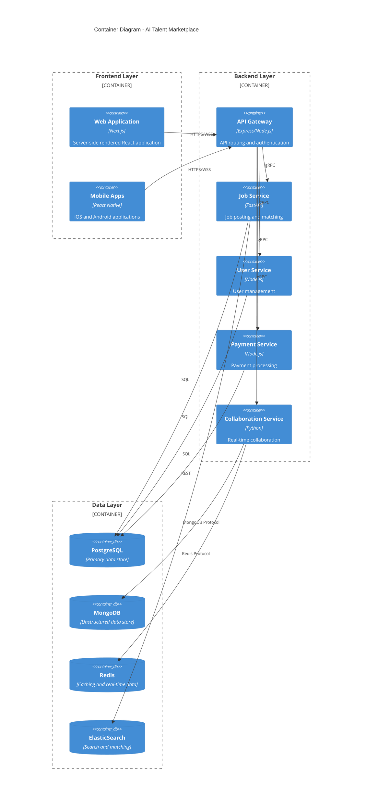

## 2.3 Component Details

| Component | Purpose | Technology Stack | Scaling Strategy |
|-----------|---------|-----------------|------------------|
| Web Frontend | User interface | Next.js, React, TailwindCSS | Horizontal scaling, CDN |
| Mobile Apps | Native experience | React Native, Redux | N/A (client-side) |
| API Gateway | Request routing | Express.js, Kong | Horizontal scaling |
| Job Service | Job management | FastAPI, Celery | Horizontal + vertical |
| User Service | User management | Node.js, TypeScript | Horizontal scaling |
| Payment Service | Payment processing | Node.js, Stripe | Horizontal scaling |
| Collaboration Service | Real-time features | Python, WebSocket | Horizontal + vertical |

## 2.4 Data Flow Architecture

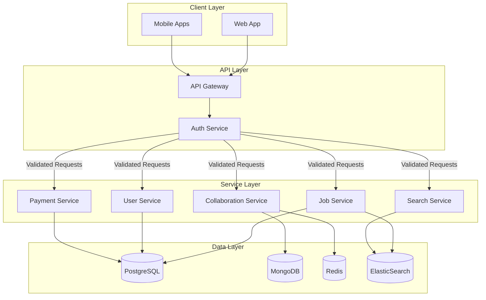

## 2.5 Deployment Architecture

```mermaid
C4Deployment
    title Deployment Diagram - AI Talent Marketplace

    Deployment_Node(cdn, "CDN", "CloudFront") {
        Container(static, "Static Assets", "S3")
    }

    Deployment_Node(aws, "AWS Cloud") {
        Deployment_Node(eks, "Kubernetes Cluster") {
            Container(frontend, "Frontend Services")
            Container(backend, "Backend Services")
            Container(workers, "Background Workers")
        }

        Deployment_Node(rds, "RDS") {
            ContainerDb(postgres, "PostgreSQL Cluster")
        }

        Deployment_Node(cache, "ElastiCache") {
            ContainerDb(redis, "Redis Cluster")
        }

        Deployment_Node(search, "OpenSearch") {
            ContainerDb(elastic, "Search Cluster")
        }

        Deployment_Node(mongo, "DocumentDB") {
            ContainerDb(mongodb, "MongoDB Cluster")
        }
    }

    Rel(cdn, eks, "Routes requests")
    Rel(eks, rds, "Persistent storage")
    Rel(eks, cache, "Caching")
    Rel(eks, search, "Search queries")
    Rel(eks, mongo, "Document storage")
```

## 2.6 Technical Decisions

### Architecture Style
- Microservices architecture for:
  - Independent scaling of components
  - Technology flexibility per service
  - Isolated failure domains
  - Team autonomy

### Communication Patterns
| Pattern | Usage | Implementation |
|---------|--------|---------------|
| Synchronous | Direct API calls | REST/GraphQL |
| Asynchronous | Background tasks | Message queues |
| Event-driven | Real-time updates | WebSocket/Redis Pub/Sub |
| RPC | Inter-service | gRPC |

### Data Storage Solutions
| Data Type | Storage | Justification |
|-----------|---------|---------------|
| Structured | PostgreSQL | ACID compliance, relations |
| Unstructured | MongoDB | Flexible schema, documents |
| Search | ElasticSearch | Full-text search, AI matching |
| Cache | Redis | In-memory, pub/sub |

## 2.7 Cross-Cutting Concerns

### Monitoring and Observability
- Metrics: Prometheus + Grafana
- Tracing: Jaeger
- Logging: ELK Stack
- Alerts: PagerDuty

### Security Architecture
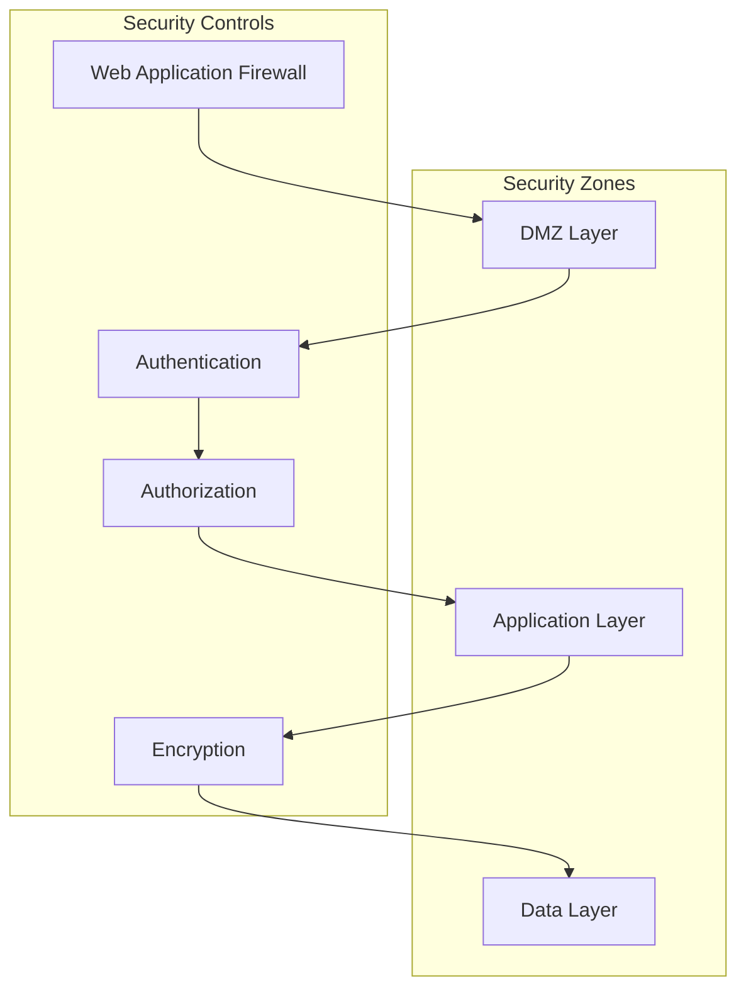

### Disaster Recovery
| Component | RPO | RTO | Strategy |
|-----------|-----|-----|----------|
| Database | 5 min | 1 hour | Multi-AZ + Cross-region |
| Application | 0 min | 5 min | Multi-region active-active |
| File Storage | 0 min | 5 min | S3 cross-region replication |
| Cache | 0 min | 1 min | Redis cluster with replicas |

# 3. SYSTEM COMPONENTS ARCHITECTURE

## 3.1 USER INTERFACE DESIGN

### 3.1.1 Design System Specifications

| Component | Specification | Implementation |
|-----------|--------------|----------------|
| Typography | System fonts with fallbacks | `-apple-system, BlinkMacSystemFont, Segoe UI, Roboto` |
| Color Palette | Primary/Secondary/Accent with a11y compliance | Base + 9 shades per color |
| Spacing System | 4px base unit with 8-point grid | `0.25rem` to `4rem` scale |
| Breakpoints | Mobile-first responsive design | `sm:640px, md:768px, lg:1024px, xl:1280px` |
| Component Library | React components with Storybook | Material UI + Custom Components |
| Accessibility | WCAG 2.1 Level AA | ARIA labels, semantic HTML |
| Dark Mode | System preference detection | CSS variables with theme context |

### 3.1.2 Layout Structure

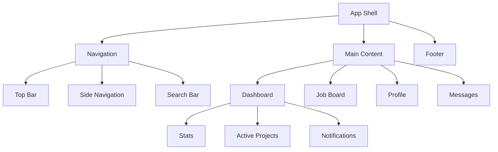

### 3.1.3 Critical User Flows

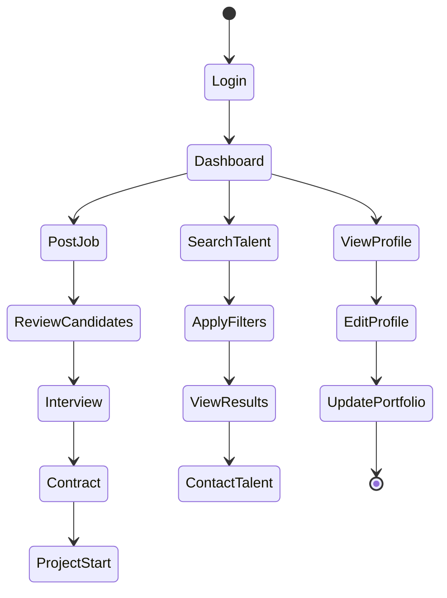

### 3.1.4 Component Specifications

| Component | States | Validation Rules | Error Handling |
|-----------|--------|-----------------|----------------|
| Input Fields | default, focus, error, disabled | Required fields, format validation | Inline error messages |
| Buttons | default, hover, active, loading, disabled | Action confirmation | Loading spinners |
| Forms | clean, dirty, submitting, error | Field-level + Form-level validation | Error summary |
| Modals | open, closing, closed | Escape key handling | Backdrop click handling |
| Toast Messages | info, success, warning, error | Auto-dismiss timer | Manual close option |

## 3.2 DATABASE DESIGN

### 3.2.1 Schema Design

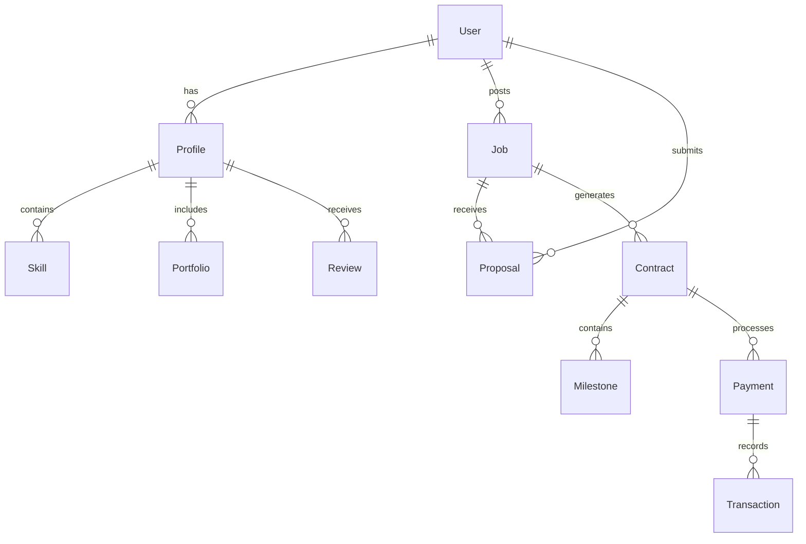

### 3.2.2 Data Models

| Entity | Fields | Indexes | Constraints |
|--------|---------|---------|------------|
| User | id, email, password_hash, role, status | email_idx, role_idx | email UNIQUE |
| Profile | id, user_id, name, skills, rate | user_id_idx, skills_idx | user_id FK |
| Job | id, title, description, budget, status | status_idx, skills_idx | budget > 0 |
| Contract | id, job_id, freelancer_id, status | status_idx | valid_status |
| Payment | id, contract_id, amount, status | contract_id_idx | amount > 0 |

### 3.2.3 Performance Optimization

| Strategy | Implementation | Monitoring |
|----------|----------------|------------|
| Caching | Redis with 1hr TTL | Cache hit ratio |
| Indexing | Compound indexes for common queries | Query performance |
| Partitioning | Date-based for historical data | Partition usage |
| Replication | Multi-AZ with read replicas | Replication lag |
| Backup | Daily snapshots, WAL archiving | Recovery time |

## 3.3 API DESIGN

### 3.3.1 API Architecture

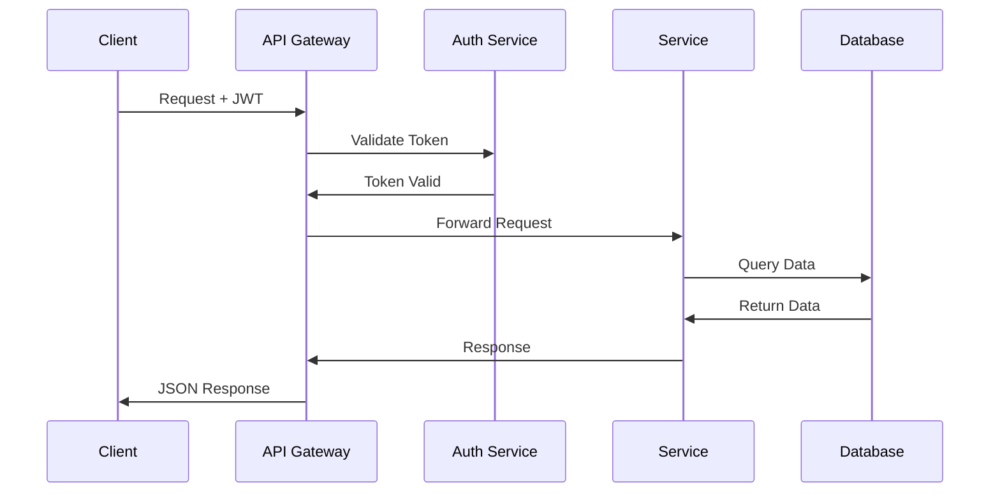

### 3.3.2 Endpoint Specifications

| Endpoint | Method | Request Format | Response Format | Auth |
|----------|--------|----------------|-----------------|------|
| /api/v1/jobs | GET | Query params | JSON array | Optional |
| /api/v1/jobs | POST | JSON body | Job object | Required |
| /api/v1/proposals | POST | JSON body | Proposal object | Required |
| /api/v1/contracts | PUT | JSON body | Contract object | Required |
| /api/v1/payments | POST | JSON body | Payment object | Required |

### 3.3.3 Security Controls

| Control | Implementation | Validation |
|---------|----------------|------------|
| Authentication | JWT + OAuth2.0 | Token expiry |
| Authorization | RBAC with scopes | Permission check |
| Rate Limiting | 100 req/min per IP | Redis counter |
| Input Validation | JSON Schema | Request validation |
| Output Sanitization | HTML escape | Response filtering |
| SSL/TLS | TLS 1.3 only | Certificate validation |

# 4. TECHNOLOGY STACK

## 4.1 PROGRAMMING LANGUAGES

| Platform/Component | Language | Version | Justification |
|-------------------|----------|---------|---------------|
| Backend Services | Node.js | 18.x LTS | - Excellent async performance for real-time features<br>- Rich ecosystem for AI/ML integrations<br>- Strong TypeScript support |
| Backend AI Services | Python | 3.11.x | - Primary language for AI/ML libraries<br>- Native support for Jupyter integration<br>- Extensive data processing capabilities |
| Frontend Web | TypeScript | 5.x | - Type safety for large-scale application<br>- Enhanced developer productivity<br>- Better integration with React ecosystem |
| Mobile Apps | TypeScript | 5.x | - Code sharing with web platform<br>- Type safety for React Native<br>- Consistent development experience |
| Smart Contracts | Solidity | 0.8.x | - Industry standard for blockchain contracts<br>- Mature tooling and security features |

## 4.2 FRAMEWORKS & LIBRARIES

### Backend Frameworks

| Framework | Version | Purpose | Justification |
|-----------|---------|---------|---------------|
| Express.js | 4.18.x | API Gateway | - Lightweight and flexible<br>- Excellent middleware ecosystem |
| FastAPI | 0.100.x | AI Services | - High performance for ML workloads<br>- Native async support |
| Socket.io | 4.7.x | Real-time Communication | - Bi-directional communication<br>- Built-in scaling support |
| Prisma | 5.x | ORM | - Type-safe database queries<br>- Multi-database support |

### Frontend Frameworks

| Framework | Version | Purpose | Justification |
|-----------|---------|---------|---------------|
| Next.js | 13.x | Web Application | - Server-side rendering<br>- Optimized performance<br>- Built-in routing |
| React Native | 0.72.x | Mobile Apps | - Cross-platform development<br>- Code sharing with web<br>- Native performance |
| TailwindCSS | 3.x | Styling | - Utility-first approach<br>- Consistent design system<br>- Reduced bundle size |
| Redux Toolkit | 1.9.x | State Management | - Centralized state management<br>- TypeScript integration |

## 4.3 DATABASES & STORAGE

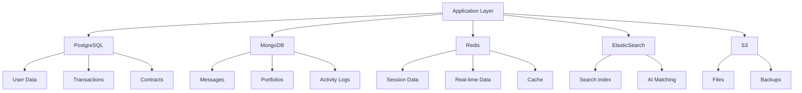

| Type | Technology | Version | Purpose |
|------|------------|---------|---------|
| Primary Database | PostgreSQL | 15.x | - Transactional data<br>- User accounts<br>- Payment records |
| Document Store | MongoDB | 6.x | - Unstructured data<br>- Portfolio items<br>- Messages |
| Cache | Redis | 7.x | - Session management<br>- Real-time features<br>- Rate limiting |
| Search Engine | ElasticSearch | 8.x | - Full-text search<br>- AI matching<br>- Analytics |
| File Storage | AWS S3 | N/A | - File uploads<br>- Backups<br>- Static assets |

## 4.4 THIRD-PARTY SERVICES

| Category | Service | Purpose | Integration Method |
|----------|---------|---------|-------------------|
| Payment Processing | Stripe | Payment handling | REST API + Webhooks |
| Authentication | Auth0 | User authentication | OAuth 2.0 + OIDC |
| Email Service | AWS SES | Transactional emails | AWS SDK |
| AI Services | OpenAI | AI matching | REST API |
| Version Control | GitHub | Code collaboration | GraphQL API |
| Monitoring | DataDog | Application monitoring | Agent + API |
| Analytics | Mixpanel | User analytics | REST API |
| Cloud Infrastructure | AWS | Infrastructure hosting | AWS SDK |

## 4.5 DEVELOPMENT & DEPLOYMENT

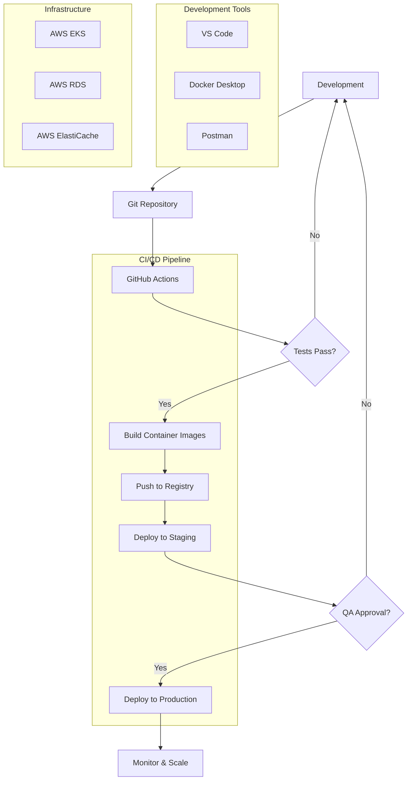

| Category | Tool | Version | Purpose |
|----------|------|---------|---------|
| IDE | VS Code | Latest | Primary development environment |
| Container Runtime | Docker | 24.x | Application containerization |
| Container Orchestration | Kubernetes | 1.27.x | Production deployment |
| CI/CD | GitHub Actions | N/A | Automated pipeline |
| Infrastructure as Code | Terraform | 1.5.x | Infrastructure management |
| API Testing | Postman | Latest | API development & testing |
| Package Management | pnpm | 8.x | Dependency management |
| Build Tool | Webpack | 5.x | Asset bundling |

# 5. SYSTEM DESIGN

## 5.1 USER INTERFACE DESIGN

### 5.1.1 Layout Structure

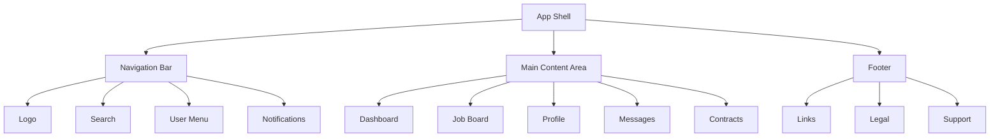

### 5.1.2 Component Hierarchy

| Component | Children | State Management | Responsive Behavior |
|-----------|----------|------------------|-------------------|
| AppShell | Navigation, MainContent, Footer | Global Theme, Auth | Fluid layout |
| Navigation | Logo, Search, UserMenu, Notifications | User Context | Collapsible menu |
| Dashboard | Stats, ActiveProjects, Recommendations | Redux Store | Grid to Stack |
| JobBoard | Filters, JobList, JobDetail | Redux Store | List to Cards |
| Profile | Portfolio, Skills, Reviews | User Context | Sections to Tabs |
| Messages | ChatList, ChatWindow, FileShare | WebSocket | Split to Full |

### 5.1.3 Interaction Patterns

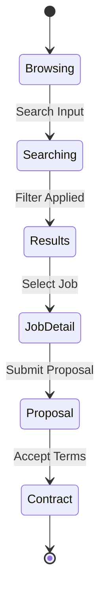

## 5.2 DATABASE DESIGN

### 5.2.1 Schema Overview

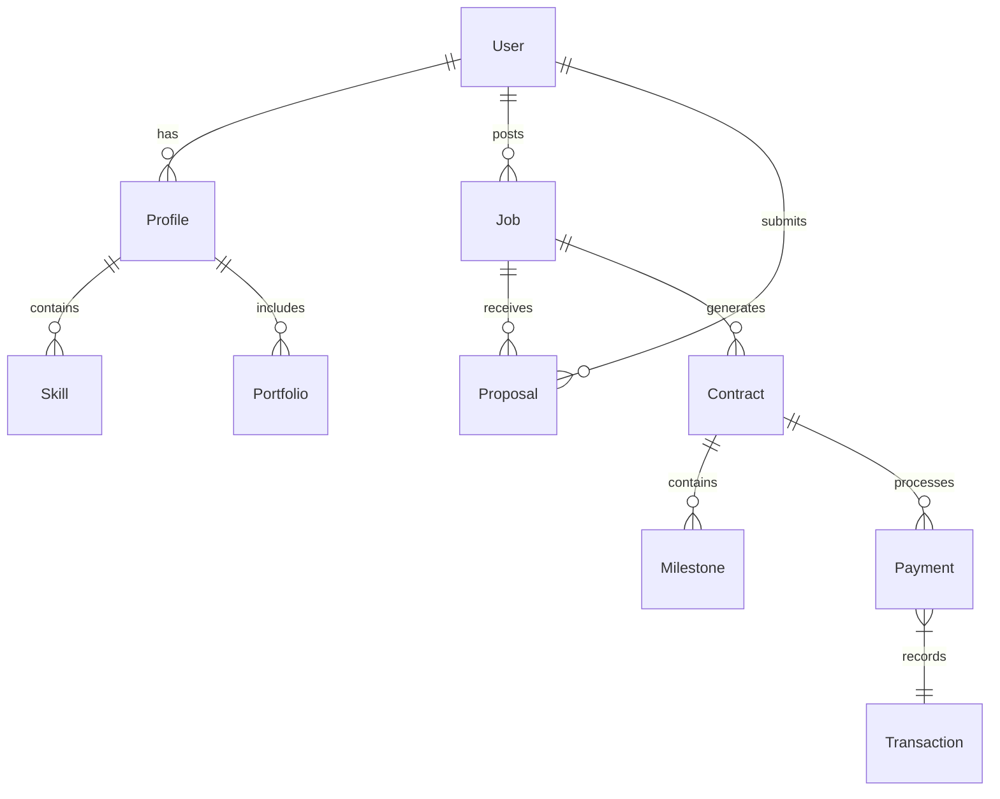

### 5.2.2 Table Specifications

| Table | Primary Key | Foreign Keys | Indexes | Partitioning |
|-------|------------|--------------|---------|--------------|
| users | uuid | - | email, role | - |
| profiles | uuid | user_id | skills_array | - |
| jobs | uuid | poster_id | status, skills | by_date |
| contracts | uuid | job_id, freelancer_id | status | by_status |
| payments | uuid | contract_id | status, date | by_month |
| transactions | uuid | payment_id | date | by_month |

### 5.2.3 Data Distribution

| Store Type | Technology | Purpose | Data Types |
|------------|------------|---------|------------|
| Primary DB | PostgreSQL | Transactional data | Users, Jobs, Contracts |
| Document Store | MongoDB | Unstructured data | Messages, Portfolios |
| Cache | Redis | Session, real-time | Active sessions, Job matches |
| Search Engine | ElasticSearch | Search, matching | Job/Profile indexes |

## 5.3 API DESIGN

### 5.3.1 API Architecture

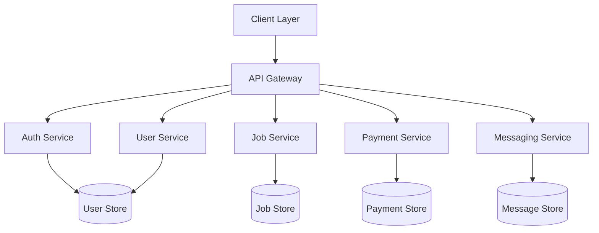

### 5.3.2 Endpoint Specifications

| Endpoint | Method | Request Format | Response Format | Auth Required |
|----------|--------|----------------|-----------------|---------------|
| /api/v1/jobs | GET | Query params | Job[] | Optional |
| /api/v1/jobs | POST | JobDTO | Job | Required |
| /api/v1/proposals | POST | ProposalDTO | Proposal | Required |
| /api/v1/contracts | PUT | ContractDTO | Contract | Required |
| /api/v1/payments | POST | PaymentDTO | Payment | Required |

### 5.3.3 Authentication Flow

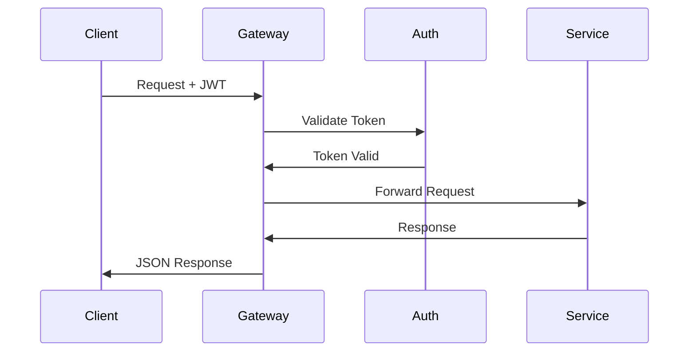

### 5.3.4 Rate Limiting

| API Category | Rate Limit | Window | Burst |
|--------------|------------|--------|--------|
| Public | 100 | 1 minute | 150 |
| Authenticated | 1000 | 1 minute | 1500 |
| Admin | 5000 | 1 minute | 7500 |
| Webhooks | 10000 | 1 minute | 15000 |

# 6. USER INTERFACE DESIGN

## 6.1 Design System Key

```
NAVIGATION & ACTIONS          FORM ELEMENTS              STATUS INDICATORS
[#] Dashboard/Menu           [...] Text Input           [====] Progress
[@] User/Profile            [ ] Checkbox               [!] Warning/Error
[=] Settings                ( ) Radio Button           [i] Information
[+] Add/Create             [v] Dropdown               [$] Payment/Financial
[x] Close/Delete           [^] File Upload            [*] Featured/Important
[<] [>] Navigation         [Button] Button            [?] Help/Support
```

## 6.2 Main Dashboard

```
+----------------------------------------------------------+
|  [#] AI Talent Marketplace                [@] [?] [$] [=]  |
+----------------------------------------------------------+
|  [Search Jobs or Talent...]                                |
+----------------------------------------------------------+
|                                                           |
|  +------------------------+  +-------------------------+   |
|  | Active Projects        |  | Notifications [!]       |   |
|  | [====] ML Model (75%)  |  | [i] New proposal       |   |
|  | [====] NLP Task (30%)  |  | [i] Message received   |   |
|  +------------------------+  +-------------------------+   |
|                                                           |
|  +------------------------+  +-------------------------+   |
|  | Recommended Jobs [*]   |  | Recent Activity        |   |
|  | > Computer Vision      |  | [@] Profile viewed     |   |
|  | > Deep Learning        |  | [$] Payment received   |   |
|  +------------------------+  +-------------------------+   |
|                                                           |
+----------------------------------------------------------+
```

## 6.3 Job Posting Form

```
+----------------------------------------------------------+
|  [<] Back to Dashboard    Create New Job      [@] [$] [=] |
+----------------------------------------------------------+
|                                                           |
|  Job Title: [..........................................]  |
|                                                           |
|  Category: [v] AI/ML Specialization                      |
|                                                           |
|  Required Skills:                                         |
|  [ ] Machine Learning    [ ] Deep Learning                |
|  [ ] Computer Vision    [ ] Natural Language Processing   |
|                                                           |
|  Budget Range:                                            |
|  ( ) Fixed Price        ( ) Hourly Rate                  |
|  [$] [...] Min          [$] [...] Max                    |
|                                                           |
|  Project Description:                                     |
|  +------------------------+                               |
|  |                        |                               |
|  |                        |                               |
|  +------------------------+                               |
|                                                           |
|  Attachments: [^ Upload Files]                           |
|                                                           |
|  [Cancel]                              [Post Job Button]  |
+----------------------------------------------------------+
```

## 6.4 AI Expert Profile

```
+----------------------------------------------------------+
|  [@] John Doe - AI Expert                    [=] [?] [*]  |
+----------------------------------------------------------+
|                                                           |
|  +------------------------+  +-------------------------+   |
|  | Expertise Level        |  | Verification Status     |   |
|  | [========] ML          |  | [i] Identity Verified   |   |
|  | [======] Deep Learning |  | [i] Skills Validated    |   |
|  | [=====] NLP            |  | [*] Top Rated          |   |
|  +------------------------+  +-------------------------+   |
|                                                           |
|  Portfolio Projects:                                      |
|  +------------------------+                               |
|  | [^] GitHub Projects    |                              |
|  | [^] Kaggle Notebooks   |                              |
|  | [^] Research Papers    |                              |
|  +------------------------+                               |
|                                                           |
|  [Contact]  [Download CV]  [Schedule Interview]           |
+----------------------------------------------------------+
```

## 6.5 Project Workspace

```
+----------------------------------------------------------+
|  Project: ML Model Development              [@] [?] [$]   |
+----------------------------------------------------------+
|  [Code] [Files] [Messages] [Milestones] [Payments]        |
+----------------------------------------------------------+
|                                                           |
|  +-------------------------+  +------------------------+   |
|  | Jupyter Notebook        |  | Project Chat          |   |
|  | +-------------------+   |  | [@] Client: Update?   |   |
|  | |                   |   |  | [@] You: Working on..|   |
|  | |                   |   |  | [...................]|   |
|  | +-------------------+   |  | [Send Message Button] |   |
|  +-------------------------+  +------------------------+   |
|                                                           |
|  Current Milestone:                                       |
|  [==============================] 75% Complete            |
|  [Submit for Review Button]                              |
+----------------------------------------------------------+
```

## 6.6 Payment Interface

```
+----------------------------------------------------------+
|  Milestone Payment                         [@] [?] [x]    |
+----------------------------------------------------------+
|                                                           |
|  Project: ML Model Development                            |
|  Milestone: Data Processing Phase                         |
|                                                           |
|  +------------------------+                               |
|  | Amount: [$] 2,500     |                               |
|  | Fee (15%): [$] 375    |                               |
|  | Total: [$] 2,875      |                               |
|  +------------------------+                               |
|                                                           |
|  Payment Method:                                          |
|  ( ) Saved Card ending 4242                              |
|  ( ) Add New Card                                        |
|  ( ) Bank Transfer                                       |
|                                                           |
|  [Cancel]                         [Process Payment Button]|
+----------------------------------------------------------+
```

## 6.7 Mobile Responsive Adaptations

```
+----------------------+  +----------------------+
| [#] AI Marketplace   |  | [@] Profile         |
+----------------------+  +----------------------+
| [Search...]          |  | John Doe            |
|                      |  | AI Expert           |
| Active Projects      |  | [====] ML Expert    |
| [====] ML Model      |  |                     |
| [====] NLP Task      |  | [Contact Button]    |
|                      |  | [Portfolio Button]   |
| [+ New Project]      |  |                     |
+----------------------+  +----------------------+

Navigation Bar (Mobile):
[#] [Search] [@] [$] [=]
```

## 6.8 Interaction States

```
Button States:
[Normal Button]
[Hover Button]
[Active Button]
[Disabled Button]

Input States:
[Normal Input........]
[Focus Input.........]
[Error Input.........]
[Success Input.......]

Alert States:
[! Error Message......]
[i Info Message......]
[* Success Message...]
[? Help Message......]
```

## 6.9 Accessibility Features

- High contrast mode support
- Screen reader compatibility with ARIA labels
- Keyboard navigation support
- Focus indicators
- Color-blind friendly palette
- Scalable text (responsive font sizes)
- Alternative text for all images and icons
- Skip navigation links
- Form error announcements
- Progress indicator announcements

# 7. SECURITY CONSIDERATIONS

## 7.1 AUTHENTICATION AND AUTHORIZATION

### 7.1.1 Authentication Methods

| Method | Implementation | Use Case | Security Level |
|--------|----------------|-----------|----------------|
| OAuth 2.0 | Auth0 Integration | Social/Professional Login (GitHub, LinkedIn) | High |
| Email/Password | Argon2id Hashing | Direct Platform Login | High |
| JWT | RS256 Algorithm | API Authentication | High |
| 2FA | TOTP + SMS Backup | Additional Security Layer | Very High |
| Biometric | React Native Biometrics | Mobile App Authentication | Very High |

### 7.1.2 Authorization Framework

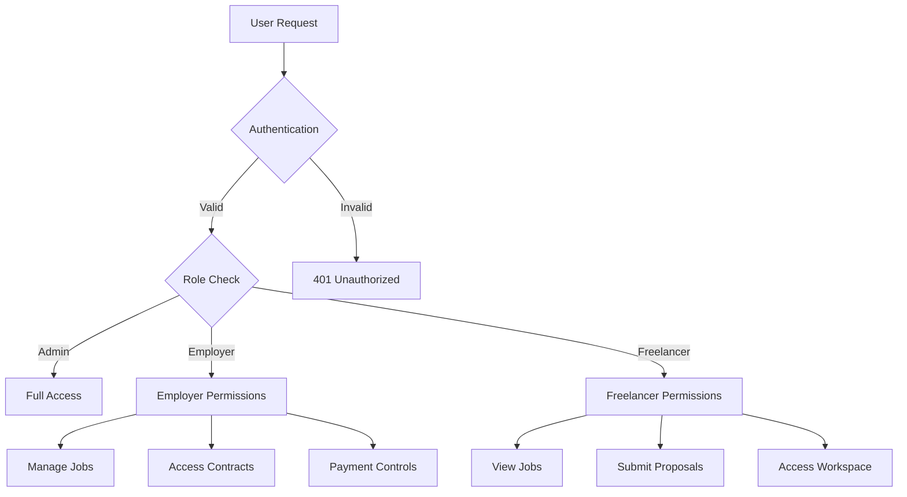

### 7.1.3 Role-Based Access Control (RBAC)

| Role | Permissions | Access Level | Restrictions |
|------|------------|--------------|--------------|
| Admin | Platform Management, User Management, Analytics | Full | None |
| Employer | Job Posting, Hiring, Payment Management | Limited | Own Resources |
| Freelancer | Job Application, Project Workspace, Portfolio | Limited | Own Resources |
| Guest | Job Browsing, Registration | Minimal | Public Data Only |

## 7.2 DATA SECURITY

### 7.2.1 Encryption Standards

| Data Type | At Rest | In Transit | Key Management |
|-----------|----------|------------|----------------|
| User Credentials | AES-256 | TLS 1.3 | AWS KMS |
| Payment Information | PCI DSS Compliant | TLS 1.3 | Stripe Vault |
| Personal Data | AES-256 | TLS 1.3 | AWS KMS |
| Project Files | AES-256 | TLS 1.3 | AWS KMS |
| Chat Messages | AES-256 | WSS | AWS KMS |

### 7.2.2 Data Protection Measures

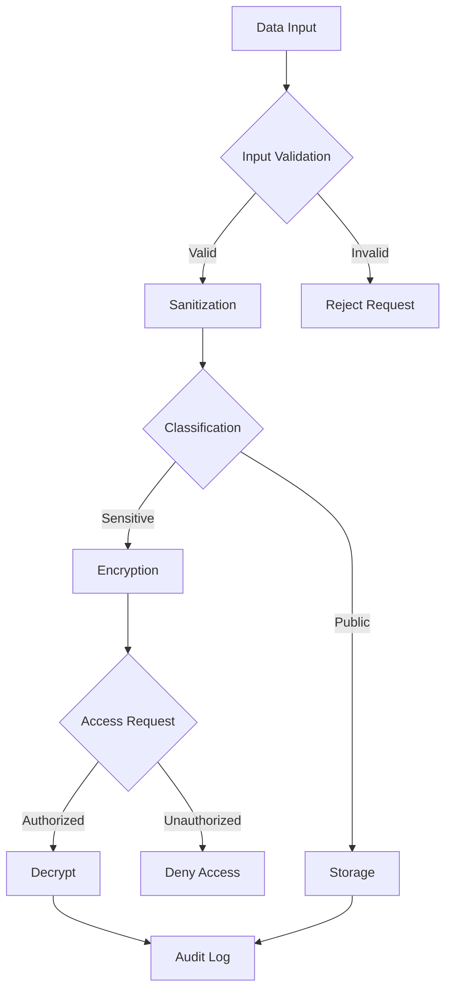

### 7.2.3 Backup and Recovery

| Component | RPO | RTO | Backup Method | Storage Location |
|-----------|-----|-----|---------------|------------------|
| User Data | 5 min | 1 hour | Continuous Replication | Multi-Region |
| Files | 15 min | 2 hours | S3 Cross-Region | Multi-Region |
| Transactions | 0 min | 30 min | Synchronous Replication | Multi-Region |
| System Logs | 5 min | 1 hour | CloudWatch Logs | Multi-Region |

## 7.3 SECURITY PROTOCOLS

### 7.3.1 Network Security

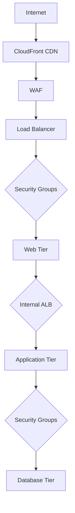

### 7.3.2 Security Monitoring and Response

| Component | Monitoring Method | Alert Threshold | Response Time |
|-----------|------------------|-----------------|---------------|
| WAF | AWS Shield | 100 requests/sec | Immediate |
| API Gateway | CloudWatch | 1000 requests/min | 5 minutes |
| Authentication | Auth0 Logs | 3 failed attempts | Immediate |
| Database | CloudWatch | Unusual access patterns | 15 minutes |
| Infrastructure | AWS GuardDuty | Threat detection | 5 minutes |

### 7.3.3 Compliance and Auditing

| Requirement | Implementation | Verification | Frequency |
|-------------|----------------|--------------|-----------|
| GDPR | Data encryption, consent management | External audit | Annual |
| SOC 2 | Security controls, monitoring | Third-party audit | Annual |
| PCI DSS | Payment security standards | Automated scans | Monthly |
| ISO 27001 | Information security management | Certification audit | Annual |
| CCPA | Privacy controls, data handling | Internal audit | Quarterly |

### 7.3.4 Vulnerability Management

| Activity | Tool | Frequency | Response SLA |
|----------|------|-----------|--------------|
| Code Scanning | SonarQube | Every commit | 24 hours |
| Dependency Checks | Snyk | Daily | 48 hours |
| Penetration Testing | Third-party | Quarterly | 1 week |
| Security Patching | Automated | Weekly | 24 hours |
| Container Scanning | Trivy | Every build | Immediate |

# 8. INFRASTRUCTURE

## 8.1 DEPLOYMENT ENVIRONMENT

### Primary Production Environment

| Component | Specification | Purpose |
|-----------|--------------|----------|
| Cloud Platform | AWS (Primary), GCP (DR) | Multi-cloud for high availability |
| Region Strategy | Multi-region active-active | US-East-1, US-West-2, EU-West-1 |
| Network Architecture | VPC with private/public subnets | Secure network isolation |
| Load Balancing | AWS ALB with WAF | Traffic distribution and security |
| CDN | CloudFront with Lambda@Edge | Global content delivery |

### Development/Staging Environments

| Environment | Purpose | Infrastructure |
|-------------|---------|---------------|
| Development | Feature development | Single region, reduced resources |
| Staging | Pre-production testing | Mirror of production, scaled down |
| QA | Quality assurance | Isolated environment with test data |
| Demo | Client demonstrations | Standalone environment with sample data |

## 8.2 CLOUD SERVICES

```mermaid
graph TD
    A[Cloud Infrastructure] --> B[Compute]
    A --> C[Storage]
    A --> D[Database]
    A --> E[Network]
    A --> F[Security]

    B --> B1[EKS - Container Orchestration]
    B --> B2[EC2 - VM Instances]
    B --> B3[Lambda - Serverless Functions]

    C --> C1[S3 - Object Storage]
    C --> C2[EBS - Block Storage]
    C --> C3[EFS - File System]

    D --> D1[RDS - PostgreSQL]
    D --> D2[DocumentDB - MongoDB]
    D --> D3[ElastiCache - Redis]
    D --> D4[OpenSearch - Search/Analytics]

    E --> E1[CloudFront - CDN]
    E --> E2[Route53 - DNS]
    E --> E3[VPC - Network Isolation]

    F --> F1[WAF - Web Application Firewall]
    F --> F2[Shield - DDoS Protection]
    F --> F3[KMS - Key Management]
```

### Service Selection Justification

| Service Category | Selected Service | Justification |
|-----------------|------------------|---------------|
| Container Management | AWS EKS | Native K8s support, scalability, multi-region support |
| Database | AWS RDS (PostgreSQL) | Managed service, automatic backups, read replicas |
| Caching | ElastiCache (Redis) | High performance, managed service, cluster mode |
| Search | OpenSearch | AI matching capabilities, managed service |
| Storage | S3 + CloudFront | Global distribution, high durability, cost-effective |
| Monitoring | CloudWatch | Integrated monitoring, custom metrics, alerts |

## 8.3 CONTAINERIZATION

### Container Architecture

```mermaid
graph TD
    A[Application Containers] --> B[Frontend Containers]
    A --> C[Backend Containers]
    A --> D[Service Containers]

    B --> B1[Web App - Next.js]
    B --> B2[Mobile API - React Native]

    C --> C1[API Gateway - Node.js]
    C --> C2[User Service - Node.js]
    C --> C3[Job Service - FastAPI]
    C --> C4[Payment Service - Node.js]

    D --> D1[Redis]
    D --> D2[ElasticSearch]
    D --> D3[MongoDB]
```

### Container Specifications

| Container Type | Base Image | Resource Limits | Scaling Strategy |
|---------------|------------|-----------------|------------------|
| Frontend | node:18-alpine | 1CPU/2GB RAM | Horizontal |
| API Services | node:18-alpine | 2CPU/4GB RAM | Horizontal |
| AI Services | python:3.11-slim | 4CPU/8GB RAM | Horizontal/Vertical |
| Database Sidecar | alpine:3.18 | 0.5CPU/1GB RAM | N/A |

## 8.4 ORCHESTRATION

### Kubernetes Architecture

```mermaid
graph TD
    A[EKS Cluster] --> B[Management Node]
    A --> C[Worker Nodes]

    B --> B1[Control Plane]
    B --> B2[etcd]
    B --> B3[API Server]

    C --> C1[Node Pool - General]
    C --> C2[Node Pool - CPU Optimized]
    C --> C3[Node Pool - Memory Optimized]

    C1 --> D1[Frontend Pods]
    C2 --> D2[Backend Pods]
    C3 --> D3[AI Service Pods]
```

### Cluster Configuration

| Component | Specification | Scaling Policy |
|-----------|--------------|----------------|
| Control Plane | Multi-AZ deployment | N/A |
| Worker Nodes | t3.xlarge (General) | Auto-scaling (2-10 nodes) |
| CPU Nodes | c6i.2xlarge | Auto-scaling (2-8 nodes) |
| Memory Nodes | r6i.2xlarge | Auto-scaling (2-6 nodes) |
| Storage | gp3 EBS volumes | Dynamic provisioning |

## 8.5 CI/CD PIPELINE

```mermaid
flowchart TD
    A[Code Push] --> B{Lint/Test}
    B -->|Pass| C[Build Containers]
    B -->|Fail| A
    C --> D[Push to Registry]
    D --> E{Deploy to Dev}
    E -->|Success| F{Automated Tests}
    E -->|Fail| C
    F -->|Pass| G{Deploy to Staging}
    F -->|Fail| A
    G -->|Success| H{Integration Tests}
    G -->|Fail| A
    H -->|Pass| I{Manual Approval}
    H -->|Fail| A
    I -->|Approved| J[Deploy to Production]
    I -->|Rejected| A
    J --> K[Post-Deploy Tests]
    K -->|Success| L[Monitor]
    K -->|Fail| M[Rollback]
```

### Pipeline Stages

| Stage | Tools | Success Criteria | Timeout |
|-------|-------|-----------------|---------|
| Code Quality | ESLint, Prettier | No errors/warnings | 5 min |
| Unit Tests | Jest, PyTest | 100% pass, 80% coverage | 10 min |
| Build | Docker | Successful build | 15 min |
| Security Scan | Snyk, SonarQube | No high/critical issues | 10 min |
| Dev Deploy | ArgoCD | Successful rollout | 10 min |
| Integration Tests | Cypress, Postman | All tests pass | 20 min |
| Production Deploy | ArgoCD | Zero-downtime deployment | 15 min |

# 8. APPENDICES

## 8.1 ADDITIONAL TECHNICAL INFORMATION

### Development Environment Setup

```mermaid
flowchart TD
    A[Local Development] --> B[Docker Desktop]
    B --> C[Development Containers]
    C --> D[Frontend Container]
    C --> E[Backend Container]
    C --> F[Database Container]
    
    D --> G[Next.js Hot Reload]
    E --> H[Node.js/FastAPI]
    F --> I[PostgreSQL/MongoDB]
    
    J[VS Code] --> K[Extensions]
    K --> L[ESLint]
    K --> M[Prettier]
    K --> N[Docker]
    K --> O[GitLens]
```

### System Monitoring Architecture

```mermaid
flowchart LR
    A[Application Metrics] --> B[Prometheus]
    C[System Metrics] --> B
    D[Custom Metrics] --> B
    B --> E[Grafana]
    E --> F[Dashboards]
    E --> G[Alerts]
    G --> H[PagerDuty]
```

### Backup Strategy Matrix

| Component | Backup Type | Frequency | Retention | Recovery Method |
|-----------|-------------|-----------|-----------|-----------------|
| PostgreSQL | Continuous WAL | Real-time | 30 days | Point-in-time recovery |
| MongoDB | Snapshot | Daily | 90 days | Collection-level restore |
| Redis | RDB + AOF | 15 minutes | 7 days | Automated failover |
| File Storage | Cross-region | Real-time | Infinite | S3 versioning |
| Elasticsearch | Snapshot | Daily | 30 days | Index restore |

## 8.2 GLOSSARY

| Term | Definition |
|------|------------|
| Argon2id | A key derivation function used for secure password hashing |
| Continuous WAL | Write-Ahead Logging for continuous database backup |
| Docker Container | A standardized unit of software packaging |
| Embeddings | Vector representations of text for AI processing |
| Hot Reload | Development feature for immediate code changes reflection |
| Jupyter Notebook | Interactive computing environment for AI development |
| Kubernetes Pod | Smallest deployable unit in container orchestration |
| Load Balancer | System that distributes network traffic across servers |
| Microservices | Architecture style where services are small and independent |
| Point-in-time Recovery | Database restoration to any past moment |
| Service Mesh | Infrastructure layer for service-to-service communication |
| Webhook | HTTP callback for real-time data transmission |

## 8.3 ACRONYMS

| Acronym | Full Form |
|---------|-----------|
| AOF | Append-Only File |
| ARIA | Accessible Rich Internet Applications |
| CDN | Content Delivery Network |
| CORS | Cross-Origin Resource Sharing |
| DTO | Data Transfer Object |
| EKS | Elastic Kubernetes Service |
| FIDO | Fast Identity Online |
| gRPC | Google Remote Procedure Call |
| MTBF | Mean Time Between Failures |
| MTTR | Mean Time To Recovery |
| OIDC | OpenID Connect |
| RDB | Redis Database |
| S3 | Simple Storage Service |
| SLA | Service Level Agreement |
| SOC | System and Organization Controls |
| TTL | Time To Live |
| VPC | Virtual Private Cloud |
| WAF | Web Application Firewall |
| WAL | Write-Ahead Logging |
| WSS | WebSocket Secure |

## 8.4 REFERENCE ARCHITECTURE

```mermaid
C4Context
    title Reference Architecture - AI Talent Marketplace

    Enterprise_Boundary(b0, "AI Talent Marketplace") {
        Person(user, "Platform User")
        
        System_Boundary(sys1, "Core Platform") {
            Container(web, "Web Application", "Next.js")
            Container(api, "API Gateway", "Express")
            Container(services, "Microservices", "Node.js/FastAPI")
            Container(ai, "AI Services", "Python/OpenAI")
        }
        
        System_Ext(auth, "Auth0", "Authentication")
        System_Ext(payment, "Stripe", "Payments")
        System_Ext(storage, "AWS S3", "Storage")
        System_Ext(compute, "AWS EKS", "Compute")
    }

    Rel(user, web, "Uses", "HTTPS")
    Rel(web, api, "Calls", "REST/GraphQL")
    Rel(api, services, "Routes to", "gRPC")
    Rel(services, ai, "Uses", "Internal API")
    
    Rel(api, auth, "Authenticates", "OAuth2")
    Rel(services, payment, "Processes", "API")
    Rel(services, storage, "Stores", "SDK")
    Rel(services, compute, "Runs on", "Kubernetes")
```